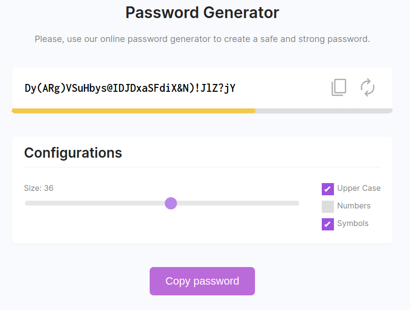

# password-generator-dev

## DESCRIPTION

Practical challenge after the Javascript lessons in the Dev Samurai frontend trainnings.

## SNAPSHOT

Below is the image showing the layout of the application functionalities after concluding the implementing project.

## FUNCTIONALITIES

* **TEXT INPUT** showing the password generated in real time during configurations
* **CONFIGURATIONS SECTION** with tools to define the size and quality of the password
* User can define the size between 4 and 64 digits for password
* User can define use of **UPPER CASE**, **NUMBERS** and **SYMNBOLS** to increase password quality
* **PASSOWRD QUALITY BAR** showing quality in real time according to configurations
* Collors on quality bar showing quality increase in real time
* **COPY BUTTON** to copy generated password
* **REFRESH BUTTON** to restart password generated

## TECHNOLOGIES

- 
- 
- 
- 
- 
- 

## AUTHOR

| [ Eduardo Brito Figueiredo](https://github.com/EduardoBritoFigueiredo)
| :---: |
